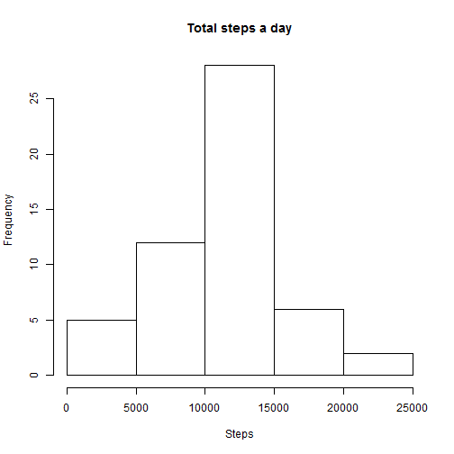

# PA1_template
## R Markdown
What is mean total number of steps taken per day?

```r
a<-read.csv("D:/Users/HBOUALI/Desktop/Coursera/activity.csv")
a$date <- as.Date(a$date)
b=aggregate(a$steps,by=list(a$date),FUN=sum)
hist(b$x,labels=unique(b$x[order(b$x)]),main="Total steps a day",xlab="Steps")
```

<!-- -->

```r
# mean of the number of steps a day is:
mean(b$x, na.rm = TRUE)
```

```
## [1] 10766.19
```

```r
# median of the number of steps a day is:
median(b$x, na.rm = TRUE)
```

```
## [1] 10765
```

What is the average daily activity pattern?

```r
c=aggregate(a$steps, by=list(a$interval), FUN=mean, na.rm=TRUE)
plot(c$Group.1,c$x, type = "l", xlab= "interval", ylab= "steps")
```

<!-- -->

```r
# Below the 5-minute interval, on average across all the days in the dataset, contains the maximum number of steps:
c$Group.1[which.max(c$x)]
```

```
## [1] 835
```

```r
colSums(is.na(a))
```

```
##    steps     date interval 
##     2304        0        0
```

```r
library(plyr)
impute.mean <- function(x) replace(x, is.na(x), mean(x, na.rm = TRUE))
d <- ddply(a, ~ interval, transform, steps = impute.mean(steps))
e=aggregate(d$steps,by=list(d$date),FUN=sum)
hist(e$x,labels=unique(e$x[order(e$x)]),main="Total steps a day",xlab="Steps")
```

<!-- -->

```r
# mean of the number of steps a day is (with averaged na's by interval):
mean(e$x, na.rm = TRUE)
```

```
## [1] 10766.19
```

```r
# median of the number of steps a day is (with averaged na's by interval):
median(e$x, na.rm = TRUE)
```

```
## [1] 10766.19
```

Are there differences in activity patterns between weekdays and weekends?

```r
library(timeDate)
d$weekends <-factor(isWeekend(d$date), levels = c("TRUE","FALSE"),labels = c("weekend", "weekday"))                
g<-subset(d,d$weekends=="weekend")
h<-subset(d,d$weekends=="weekday")
i=aggregate(g$steps, by=list(g$interval), FUN=mean, na.rm=TRUE)
j=aggregate(h$steps, by=list(h$interval), FUN=mean, na.rm=TRUE)
par(mfrow=c(2,1))
plot(i$Group.1,i$x, type = "l",main= "weekend", xlab= "interval", ylab= "steps")
plot(j$Group.1,j$x, type = "l",main= "weekday", xlab= "interval", ylab= "steps")
```

<!-- -->
knit('rep_res_1.Rmd')
